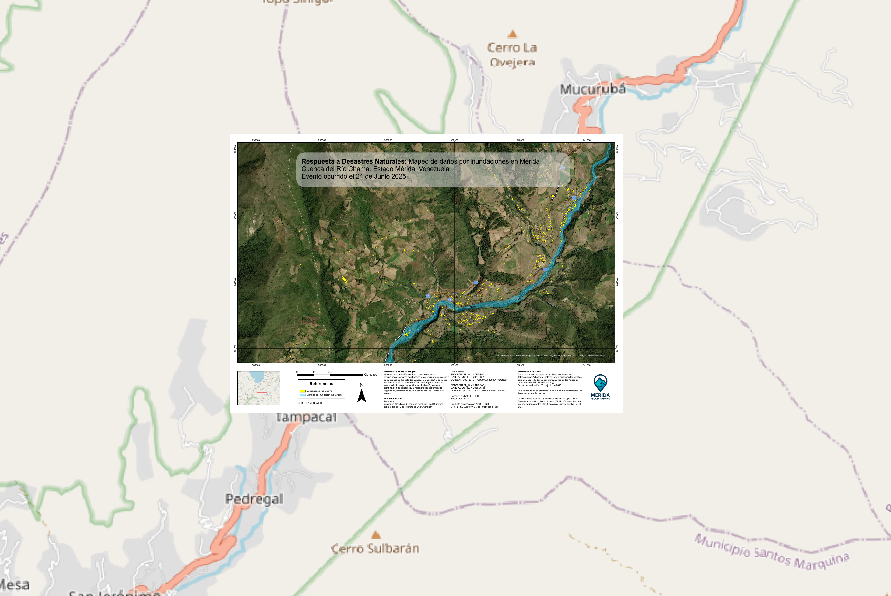
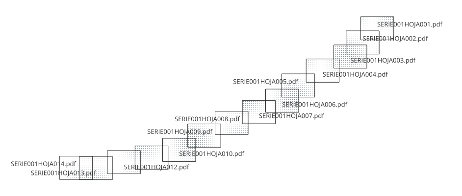

# Descripción

La serie 001 consta de un juego de 14 archivos geoPDF con la interpretación del área inundada y las zonas afectadas incluyendo las viviendas que se identificaron en la zona.

Los archivos geoPDF se pueden abrir directamente dentro de las herramientas de escritorio para análisis de sistemas de información geográfica.

Se aprecia dentro de qGis, usando OpenStreetMap de fondo, el archivo SERIE001HOJA001.pdf mostrando la interpretación del área inundada por el río Chama, en la zona cercana al pueblo de Cacute.

Un índice de las hojas disponibles se presenta a continuación:
