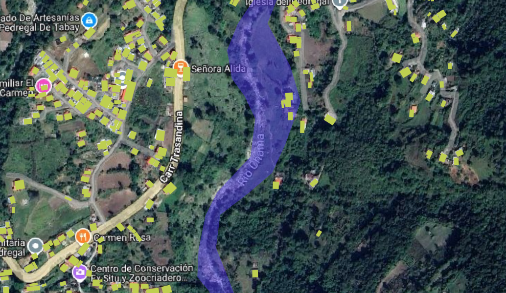

# Interpretación visual de la zona afectada

Mancha de inundación delimitada como un polígono usando datos de Landsat del 25 al 26 de junio de 2025.

Se presenta en el archivo [inundación](Inundacion25al16-06-2025.geojson) con el polígono GeoJson con la delineación por interpretación visual de la zona afectada por la crecida del río Chama. 

El [archivo con extensión qgz](Inundacion25al16-06-2025-map.qgz) es un proyecto de qGis para que se observe esa mancha de inundación sobre el mapa base  de Google satélite con rótulos.

El archivo de [infraestructuras](ChamaZ1-buildings.geojson) tiene una parte de la base de datos de MS Buildigns para esta zona.
